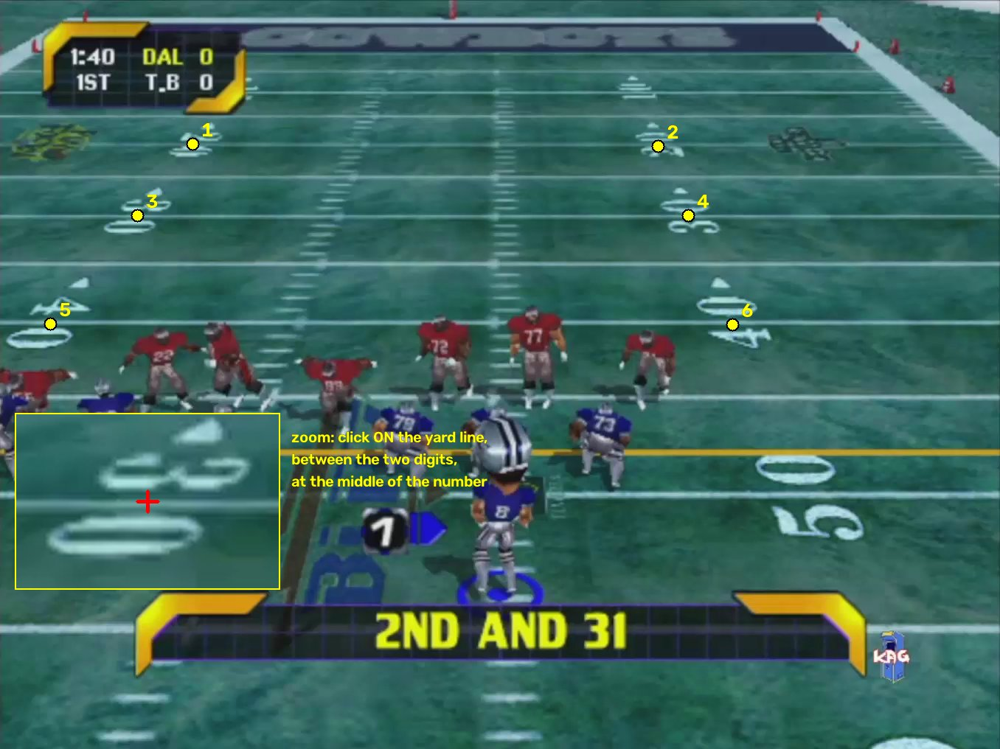

# NFL Blitz Field and Camera Tracker

OpenCV prototype for detecting football-field lines, establishing a fixed field coordinate system, and tracking virtual camera movement in prerecorded NFL Blitz 2000 footage.

## Setup

```bash
python3 -m venv .venv
source .venv/bin/activate
python3 -m pip install -r requirements.txt
```

Put gameplay clips in `data/input/` and run every command from the repository root. Clips are referred to by the start of their file name (for example `Clip_2`), so names with spaces need no quotes.

## 1. Field-Line Detection (optional)

```bash
python -m src.main
```

Processes every clip in `data/input/` and saves `data/output/<clip>_lines.mp4`.

## 2. Calibrate a Clip

Once per clip:

```bash
python -m src.initialize_homography Clip_2
```

Click the center of each painted yard number, in the order shown on screen: on the yard line, between the two digits, at the middle of the number's width.



```text
1: 20-yard line, left number    2: 20-yard line, right number
3: 30-yard line, left number    4: 30-yard line, right number
5: 40-yard line, left number    6: 40-yard line, right number
```

Controls: left click to select, `U` undo, `R` reset, `Enter` calculate, `Esc` cancel.

Options:

| Option | Use |
| --- | --- |
| `--frame N` | Click on frame `N` instead of frame 0, if points are covered |
| `--yard-lines 10 20 30` | Click different yard lines |
| `--far-half` | The yard lines are on the half away from the COWBOYS end zone (needed for `Clip_1`, where the 20 is nearest the bottom of the screen) |

Saves `data/output/<clip>_homography.npz` and `data/output/<clip>_homography_preview.png`. Check that the purple grid sits on the yard lines; if not, run it again.

## 3. Track the Clip

```bash
python -m src.track_video Clip_2
```

Leave out the name to track every calibrated clip. Saves `data/output/<clip>_tracked.mp4`: the purple grid should stay on the painted lines as the camera moves.

## Example

```bash
source .venv/bin/activate
python -m src.initialize_homography gameplay3
python -m src.initialize_homography Clip_2
python -m src.initialize_homography Clip_4
python -m src.initialize_homography Clip_1 --far-half
python -m src.track_video
```
